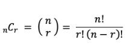

출처 : https://www.acmicpc.net/problem/1010

### 문제
재원이는 한 도시의 시장이 되었다. 이 도시에는 도시를 동쪽과 서쪽으로 나누는 큰 일직선 모양의 강이 흐르고 있다. 하지만 재원이는 다리가 없어서 시민들이 강을 건너는데 큰 불편을 겪고 있음을 알고 다리를 짓기로 결심하였다. 강 주변에서 다리를 짓기에 적합한 곳을 사이트라고 한다. 재원이는 강 주변을 면밀히 조사해 본 결과 강의 서쪽에는 N개의 사이트가 있고 동쪽에는 M개의 사이트가 있다는 것을 알았다. (N ≤ M)

재원이는 서쪽의 사이트와 동쪽의 사이트를 다리로 연결하려고 한다. (이때 한 사이트에는 최대 한 개의 다리만 연결될 수 있다.) 재원이는 다리를 최대한 많이 지으려고 하기 때문에 서쪽의 사이트 개수만큼 (N개) 다리를 지으려고 한다. 다리끼리는 서로 겹쳐질 수 없다고 할 때 다리를 지을 수 있는 경우의 수를 구하는 프로그램을 작성하라.

![[다리놓기1]](../images/2024-02-12-baekjun1/Pasted image 20240207214210.png)

### 입력
입력의 첫 줄에는 테스트 케이스의 개수 T가 주어진다. 그 다음 줄부터 각각의 테스트케이스에 대해 강의 서쪽과 동쪽에 있는 사이트의 개수 정수 N, M (0 < N ≤ M < 30)이 주어진다.

### 출력
각 테스트 케이스에 대해 주어진 조건하에 다리를 지을 수 있는 경우의 수를 출력한다.

![[다리놓기2]](../images/2024-02-12-baekjun1/Pasted image 20240207215112.png)


### 접근 방법

1. 한 사이트에는 한 개의 다리만 놓일 수 있다.
2. 서로 다른 다리가 겹치면 안된다. 

즉, 한 사이트에 두개의 다리가 놓이거나, 서로 다른 다리가 가로지르면 안된다. 
M개에서 N개를 선택, 서로 중복되면 안됨.

-> '조합공식'

nCr 공식을 이용. 
즉 M개에서 N개를 뽑는 것이기 때문에 mCn이 됨.

순서를 고려하지 않기 때문에 다른 다리가 겹치는 경우는 제외됨. 




```java
int[][] dp = new[30][30];	// 최대입력값이 29이므로 
 
main() {
 
	int T = input();	// 반복횟수
 
	for(int i = 0; i < T; i++) {
    
		int N = input();
		int M = input();
 
		// M개중 N개를 뽑는 경우이므로 nCr 에서 n = M, r = N이다.
		print(combi(M, N));
	}
}
 
int combi(int n, int r) {
 
	// 이미 탐색했던 경우 바로 반환
	if(dp[n][r] > 0) {
		return dp[n][r];
	}
 
	// 2번 성질
	if(n == r || r == 0) {
		return dp[n][r] = 1;
	}
	// 1번 성질
	return combi(n - 1, r - 1) + combi(n - 1, r);
}
```

위와 같이  하나의 식으로 완성할 수 있다. 

또는 bottom-up 방식을 이용해
```java
main() {
 
	int[][] dp = new int[30][30];
 
	// 2번 성질 (n == r, r == 0)
	for (int i = 0; i < 30; i++) {
		dp[i][i] = 1;
		dp[i][0] = 1;
	}
			
 
	for (int i = 2; i < 30; i++) {
		for (int j = 1; j < 30; j++) {
			// 1번 성질 
			dp[i][j] = dp[i - 1][j - 1] + dp[i - 1][j];
		}
	}
        		
	int T = input();	// 테스트케이스
 
	for(int i = 0; i < T; i++) {
 
		// M개중 N개를 뽑는 경우이므로 nCr 에서 n = M, r = N이다.
		int N = input();	// N = r
		int M = input();	// M = n
			
		print(dp[M][N]);
	}
}
```
이와 같이 활용.


### 풀이
1.  Scanner + 재귀

```java
import java.util.Scanner;
 
public class Main {
	
	static int[][] dp = new int[30][30];
 
	public static void main(String[] args) {
		
		Scanner in = new Scanner(System.in);
		
		int T = in.nextInt();
		
		StringBuilder sb = new StringBuilder();
        
		for(int i = 0; i < T; i++) {
			
			// M개중 N개를 뽑는 경우이므로 nCr 에서 n = M, r = N이다.
			int N = in.nextInt();	// N = r
			int M = in.nextInt();	// M = n
						
			sb.append(combi(M, N)).append('\n');
		}
		
		System.out.println(sb);
		
	}
	
	static int combi(int n, int r) {
		
		// 이미 풀린 경우 바로 반환
		if(dp[n][r] > 0) {
			return dp[n][r]; 
		}
		
		// 2번 성질
		if(n == r || r == 0) {
			return dp[n][r] = 1;
		}
		
		// 1번 성질
		return dp[n][r] = combi(n - 1, r - 1) + combi(n - 1, r);
	}
}
```

2.  Scanner+반복문

```java
import java.util.Scanner;
 
public class Main {
 
	public static void main(String[] args) {
		
		Scanner in = new Scanner(System.in);
		
		int[][] dp = new int[30][30];
 
		// 2번 성질 (n == r, r == 0)
		for (int i = 0; i < 30; i++) {
			dp[i][i] = 1;
			dp[i][0] = 1;
		}
			
 
		for (int i = 2; i < 30; i++) {
			for (int j = 1; j < 30; j++) {
				// 1번 성질 
				dp[i][j] = dp[i - 1][j - 1] + dp[i - 1][j];
			}
		}
        
        
		
		int T = in.nextInt();
	
		StringBuilder sb = new StringBuilder();
        
		for(int i = 0; i < T; i++) {
 
			// M개중 N개를 뽑는 경우이므로 nCr 에서 n = M, r = N이다.
			int N = in.nextInt();	// N = r
			int M = in.nextInt();	// M = n
			
			sb.append(dp[M][N]).append('\n');
		}
		
		System.out.println(sb);
 
	}
}
```

3.  BufferedReader+재귀

```java
import java.io.BufferedReader;
import java.io.InputStreamReader;
import java.io.IOException;
import java.util.StringTokenizer;
 
public class Main {
	
	static int[][] dp = new int[30][30];
 
	public static void main(String[] args) throws IOException {
		
		BufferedReader br = new BufferedReader(new InputStreamReader(System.in));
		
		int T = Integer.parseInt(br.readLine());
		
		StringTokenizer st;
		
		StringBuilder sb = new StringBuilder();
		for(int i = 0; i < T; i++) {
			
			st = new StringTokenizer(br.readLine(), " ");
			
			// M개중 N개를 뽑는 경우이므로 nCr 에서 n = M, r = N이다.
			int N = Integer.parseInt(st.nextToken());	// N = r
			int M = Integer.parseInt(st.nextToken());	// M = n
					
			
			sb.append(combi(M, N)).append('\n');
		}
		
		System.out.println(sb);
 
	}
	
	static int combi(int n, int r) {
		
		// 이미 풀린 경우 바로 반환
		if(dp[n][r] > 0) {
			return dp[n][r]; 
		}
		
		// 2번 성질
		if(n == r || r == 0) {
			return dp[n][r] = 1;
		}
		
		// 1번 성질
		return dp[n][r] = combi(n - 1, r - 1) + combi(n - 1, r);
	}
}
```

4.  BufferedReader+반복문

```java
import java.io.BufferedReader;
import java.io.InputStreamReader;
import java.io.IOException;
import java.util.StringTokenizer;
 
public class Main {
 
	public static void main(String[] args) throws IOException {
		
		BufferedReader br = new BufferedReader(new InputStreamReader(System.in));
		
		int[][] dp = new int[30][30];
 
		// 2번 성질 (n == r, r == 0)
		for (int i = 0; i < 30; i++) {
			dp[i][i] = 1;
			dp[i][0] = 1;
		}
			
 
		for (int i = 2; i < 30; i++) {
			for (int j = 1; j < 30; j++) {
				// 1번 성질 
				dp[i][j] = dp[i - 1][j - 1] + dp[i - 1][j];
			}
		}
		
		int T = Integer.parseInt(br.readLine());
		
		StringTokenizer st;
		StringBuilder sb = new StringBuilder();
        
		for(int i = 0; i < T; i++) {
			
			st = new StringTokenizer(br.readLine(), " ");
			
			// M개중 N개를 뽑는 경우이므로 nCr 에서 n = M, r = N이다.
			int N = Integer.parseInt(st.nextToken());	// N = r
			int M = Integer.parseInt(st.nextToken());	// M = n
					
			sb.append(dp[M][N]).append('\n');
		}
		
		System.out.println(sb);
 
	}
}
```


### 알고리즘 분류
#수학
#다이나믹프로그래밍
#조합론
